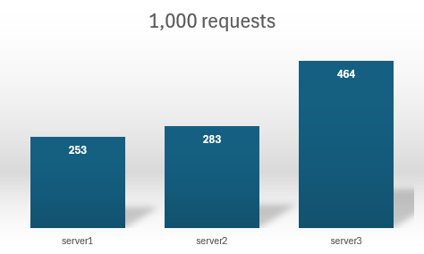
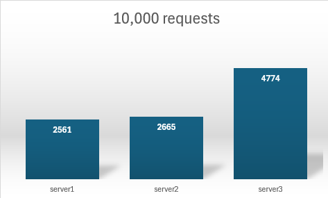

# Implementing a Load Balancer with Flask and Docker

## Introduction

This project demonstrates the implementation of a load balancer using consistent hashing with Python, Flask, and Docker. Consistent hashing is an efficient technique used to distribute data evenly across a cluster of servers, ensuring minimal disruption when servers are added or removed. This load balancer manages server replicas and routes requests to the appropriate server using consistent hashing.

## Requirements

- Docker Desktop
- Python 3.8+

## How to Run the Project

1. **Clone the Repository**

   Clone this repository to your local machine.

   ```sh
   git clone <repository-url>
   cd <repository-directory>
   ```

2. **Set Up a Virtual Environment**

   Create and activate a virtual environment.

   ```sh
   python -m venv venv
   source venv/bin/activate 
   ```

3. **Install Requirements**

   Install the necessary Python packages.

   ```sh
   pip install -r requirements.txt
   ```

4. **Run the Application**

   Use Docker Compose to build and run the application.

   ```sh
   docker-compose up --build
   ```

   This will start the Flask application and an Nginx load balancer.

## API Endpoints

- **`GET /`**: Returns a simple homepage message.

- **`GET /home`**: Returns a greeting message from a specific server.

- **`GET /rep`**: Returns the list of current server replicas.

- **`POST /add`**: Adds replicas to the load balancer.

- **`DELETE /rm`**: Removes defined replicas from the load balancer.

## API Endpoints Testing
- **`GET /home`**: Returns a greeting message from a specific server
  - Response:
    ```json
    {
      "message": "Hello from server: <serverID>",
      "status": "succesful"
    }
    ```

- **`GET /rep`**: Returns the list of current server replicas.
  - Response:
    ```json
    {
      "message": {
      "N" : 4,
      "replicas": [
        "server1",
        "server2",
        "server3",
      ]
    },
    "status": "succesful"
    }
    ```

- **`POST /add`**: Adds new server replicas. Assuming the load balancer started with 3 servers: [server1, server2. server3]
  - Request body:
    ```json
    {
      "n": 1,
      "hostnames": ["s4"]
    }
    ```
  - Response:
    ```json
    {
      "message": {
      "N" : 4,
      "replicas": [
        "server1",
        "server2",
        "server3",
        "s4"
      ]
    },
    "status": "succesful"
    }
    ```

- **`DELETE /rm`**: Removes existing server replicas.
  - Request body:
    ```json
    {
      "n": 1,
      "hostnames": ["s4"]
    }
    ```
  - Response:
    ```json
    {
      "message": {
      "N" : 3,
      "replicas": [
        "server1",
        "server2",
        "server3",
      ]
    },
    "status": "succesful"
    }


<br>

# Analysis
This section is to test how the load balancer is distributing the load to the different servers that are available. To run this test, you will open the tests folder and run the test script using
`python test.py`. <br><br>
**Disclaimer:** When running the test file, ensure to change the num_requests parameter to change the number of requests that you would like to test for.

## Testing the load balancer with N=3 and num_requests=1000
**Response from the terminal** <br>
 <br><br>
**Plot**<br>

<br><br>

## Testing the load balancer with N=3 and num_requests=10000
**Response from the terminal** <br>
 <br><br>
**Plot**<br>



<br><br>

## Conclusion

This project showcases the implementation of a load balancer using consistent hashing to distribute requests evenly across a cluster of servers. By using Flask for the web application and Docker for containerization, the project ensures easy deployment and management. The provided API endpoints allow dynamic management of server replicas, making it a robust solution for handling distributed requests in a scalable manner.